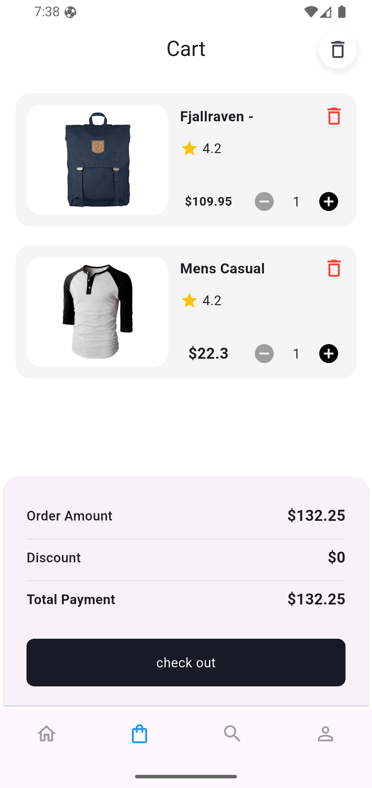
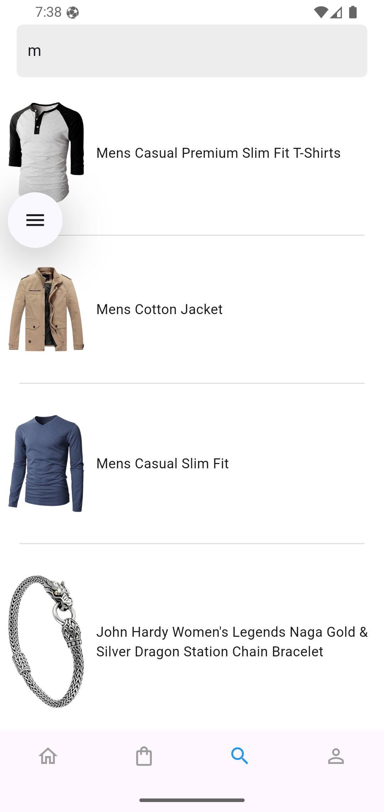

# 🛒 Cartify

Cartify is an **E-Commerce application** built with Flutter.  
It allows users to browse products, search, add them to the cart, place orders, and edit existing orders.

---

## ✨ Features
- Display a list of products.
- Search for products.
- Add products to the shopping cart.
- Manage orders (Add / Edit).
- Supports **RESTful API** for fetching data.
- Local storage with **SQLite** and **Shared Preferences**.
- Integration with **Firebase** for notifications and storage.
- Modern design using **Flutter & Dart**.

---

## 📂 Tech Stack
- **Flutter (Dart)**
- **Cubit / Bloc** for state management
- **Dio / http** for API requests
- **SQLite & SharedPreferences** for local storage
- **Firebase** (notifications & optional auth)

---

## 📷 UI Screenshots  

<p float="left">
  
   
  
  

</p>
---

## 🚀 Getting Started

### Installation
```bash
git clone https://github.com/<your-username>/cartify.git
cd cartify
flutter pub get
flutter run
